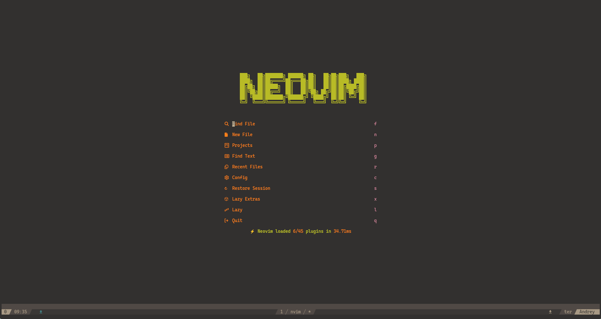
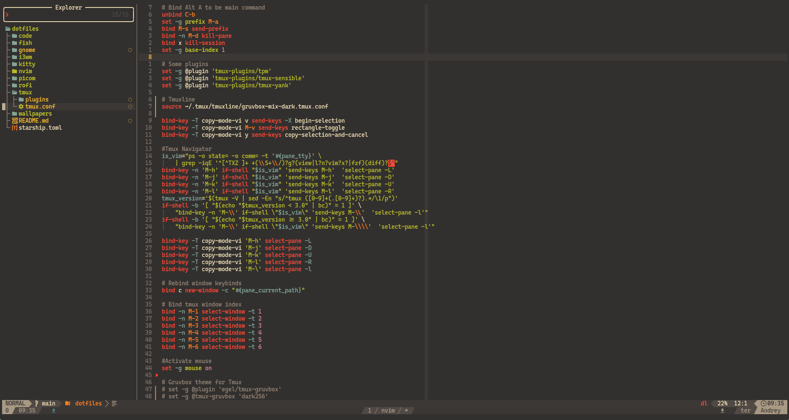

# Don't mind me, just leaving some of my Dotfiles here...

These are my dotfiles, so I can import my configs to any other development
environment(mainly in Linux). You probably can use them in a WSL environment,
but I can't guarantee it'll work properly, cause WSL can get a little bit
buggy sometimes. Some details that you should keep in mind is the version of
a few packages, such as NodeJS and NPM, also remembering to install
python-virtualenv.

## Gallery

